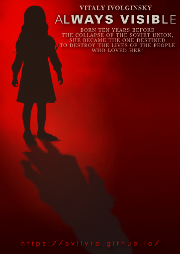

# Always Visible – Mobile Horror Story

  

## Description

Welcome to **Always Visible – Mobile Horror Story** – an Android app that presents a unique literary adventure in the horror genre. This is not a game or a comic, but a book designed to immerse you in a world of thrilling stories inspired by classics like **“The Omen”** and **“The Ring”**. Despite its simplicity in format, this book is crafted to leave a lasting impression.

## About the App

**Always Visible (Another Prayer for the Dying Horror Genre)** is a literary cocktail that blends elements from renowned authors and iconic horror films. Imagine a work influenced by the likes of the **Strugatsky Brothers**, **Theodore Dreiser** and **Bogomil Raynov**, with a touch of homage to the literary greats of the past. This isn't your typical fan fiction; it’s a creative experiment that reimagines horror motifs into something uniquely captivating.

### Key Features

- **Innovative Storytelling**: A rich narrative that transforms familiar horror themes into fresh, unexpected twists.
- **Literary Homages**: Experience parodies and crossovers, including a daring mix of **“The Picture of Dorian Gray”** with **“Alice in Wonderland”** and **“Snow White and the Seven Dwarfs”**.
- **Dynamic Plot**: From tear-jerking romances to gripping detective investigations, the story offers a roller-coaster of emotions.
- **Multiple Main Characters**: Follow three distinct protagonists through a plot full of surprises and shifting tones.
- **Open Ending**: Engage with an open-ended conclusion that invites you to interpret and imagine your own ending.

## Acknowledgements

We extend our gratitude to the authors and creators whose works have inspired the creation of **Always Visible (Another Prayer for the Dying Horror Genre)**. Your contributions to literature and horror have shaped this unique experiment.

## How to Build

Clone the repository with git clone https://github.com/avlivro/org.bookavlivro.avlivro.book.git, open the project in Android Studio by selecting "Open an existing project" and navigating to the cloned directory, then build the project and run the app on an emulator or physical device.

## License

This project is licensed under the [CC0 1.0 Universal (CC0 1.0) Public Domain Dedication](https://creativecommons.org/publicdomain/zero/1.0/). The literary work itself is in the public domain, and the repository is released under the same license, allowing you to use, modify, and distribute the content freely.
